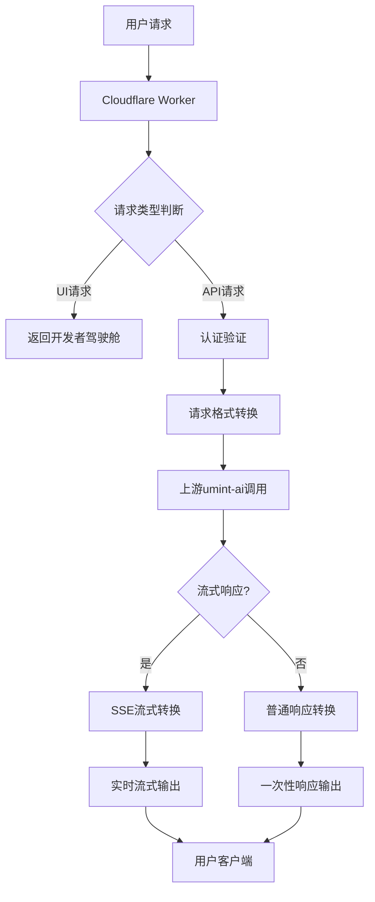
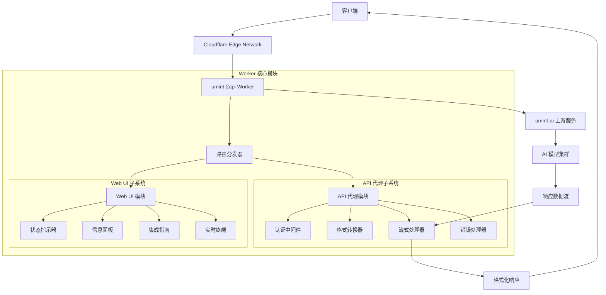

# 🚀 umint-2api Cloudflare Worker

<div align="center">


**✨ 将 umint-ai.hf.space 转换为 OpenAI 兼容 API 的高性能代理 ✨**

[快速开始](#-懒人一键部署) • [使用教程](#-详细使用教程) • [技术原理](#-技术原理详解) • [贡献指南](#-扩展开发指南)

</div>

## 📖 目录

- [🎯 项目简介](#-项目简介)
- [✨ 核心特性](#-核心特性)
- [⚡ 快速开始](#-快速开始)
- [🚀 懒人一键部署](#-懒人一键部署)
- [📚 详细使用教程](#-详细使用教程)
- [🔧 技术原理详解](#-技术原理详解)
- [🏗️ 系统架构](#️-系统架构)
- [📊 功能对比](#-功能对比)
- [🔮 未来发展](#-未来发展)
- [🛠️ 扩展开发](#️-扩展开发)
- [📋 项目结构](#-项目结构)
- [📄 开源协议](#-开源协议)
- [🤝 贡献指南](#-贡献指南)
- [💝 致谢](#-致谢)

## 🎯 项目简介

> 🌟 **"让每个人都能轻松访问最先进的AI模型"** - 这就是 umint-2api 的使命！

umint-2api 是一个创新的 **Cloudflare Worker 单文件应用**，它巧妙地将 [umint-ai.hf.space](https://umint-ai.hf.space) 的后端服务转换为完全兼容 **OpenAI API 标准** 的高性能接口。

### 🎪 项目诞生记

```
🤔 问题发现：umint-ai 提供了强大的多模型访问能力，但缺乏标准API接口
💡 灵感闪现：为什么不创建一个桥梁，让开发者能像使用OpenAI一样使用umint？
🛠️ 技术实现：利用Cloudflare Worker的轻量级边缘计算能力
🎯 目标达成：现在你可以用熟悉的OpenAI SDK访问16个顶级AI模型！
```

## ✨ 核心特性

### 🎨 用户体验
- **🧩 开箱即用** - 单文件部署，无需复杂配置
- **🎪 开发者驾驶舱** - 内置功能丰富的Web UI，实时监控和测试
- **📱 响应式设计** - 在手机、平板、电脑上都有完美体验

### 🔧 技术特性
- **🔌 OpenAI 完全兼容** - 支持所有主流OpenAI SDK和客户端
- **⚡ 高性能代理** - 基于Cloudflare全球边缘网络
- **🔄 实时流式传输** - 支持Server-Sent Events (SSE) 流式响应
- **🔒 企业级安全** - Bearer Token认证 + CORS跨域支持

### 🌟 模型支持
**🚀 16个顶级AI模型一键调用！**
- 🎯 **推理王者**: `moonshotai/kimi-k2-thinking`
- 🧠 **代码专家**: `qwen/qwen3-coder-480b-a35b-instruct`  
- 💭 **思维巨匠**: `qwen/qwen3-max-thinking`
- 🔥 **最新技术**: `openai/gpt-5-chat-latest`
- ... 还有更多等你探索！

## ⚡ 快速开始

### 📋 前置要求
- [x] Cloudflare 账户（[免费注册](https://dash.cloudflare.com/sign-up)）
- [x] 基本的Web使用经验
- [ ] 无需服务器知识！🎉

### 🚀 懒人一键部署

<div align="center">

**👇 点击下方按钮，1分钟完成部署！👇**

[](https://deploy.workers.cloudflare.com/?url=https://github.com/lzA6/umint-2api-cfwork)

</div>

#### 🎯 一键部署详细步骤

1. **点击上方蓝色按钮** 🖱️
2. **登录/注册 Cloudflare 账户** 🔐
3. **选择部署位置** 🌍（推荐选择离你近的区域）
4. **点击 "Deploy"** 🚀
5. **等待部署完成** ⏳（约30秒）
6. **复制你的 Worker URL** 📋
7. **开始使用！** 🎊

**💡 小贴士**: 部署完成后，访问你的 Worker URL 就能看到功能完整的开发者驾驶舱！

## 📚 详细使用教程

### 🎪 开发者驾驶舱使用指南

访问你的 Worker 根路径，你将看到一个功能强大的控制台：

```
https://你的worker.你的子域名.workers.dev/
```

#### 🎛️ 控制台功能详解

| 区域 | 功能 | 图标 | 说明 |
|------|------|------|------|
| **🔍 状态指示器** | 服务健康检查 | 🟢⚪🔴 | 实时显示API服务状态 |
| **📋 信息面板** | API配置信息 | 📊 | 显示Endpoint、API Key等 |
| **🛠️ 集成指南** | 客户端配置 | 📱💻 | cURL、Python、LobeChat等 |
| **💬 实时终端** | API测试工具 | 🎮 | 直接在网页测试API |

### 🔑 API 密钥配置

**默认 API Key**: `1` （就是这么简单！🎯）

```bash
# 在所有请求的 Header 中使用
Authorization: Bearer 1
```

### 🎯 主流客户端集成

#### 1. 🐍 Python 客户端

```python
import openai

client = openai.OpenAI(
    api_key="1",  # 你的API密钥
    base_url="https://你的worker.子域名.workers.dev/v1"  # 你的Worker地址
)

# 流式聊天
stream = client.chat.completions.create(
    model="moonshotai/kimi-k2-thinking",
    messages=[{"role": "user", "content": "你好，请介绍一下你自己"}],
    stream=True,
)

for chunk in stream:
    print(chunk.choices[0].delta.content or "", end="")
```

#### 2. 🔄 cURL 命令

```bash
curl --location 'https://你的worker.子域名.workers.dev/v1/chat/completions' \
--header 'Content-Type: application/json' \
--header 'Authorization: Bearer 1' \
--data '{
    "model": "moonshotai/kimi-k2-thinking",
    "messages": [
        {
            "role": "user",
            "content": "你好，你是什么模型？"
        }
    ],
    "stream": true
}'
```

#### 3. 💬 LobeChat 配置

在 LobeChat 设置中：
- **API Key**: `1`
- **API 地址**: `https://你的worker.子域名.workers.dev`
- **模型列表**: 选择你需要的模型

#### 4. 🌐 Next-Web 部署

环境变量配置：
```bash
CODE=1
BASE_URL=https://你的worker.子域名.workers.dev
CUSTOM_MODELS=+moonshotai/kimi-k2-thinking,+deepseek-ai/deepseek-r1-0528,...
```

### 🔍 API 端点说明

| 端点 | 方法 | 功能 | 示例 |
|------|------|------|------|
| `GET /v1/models` | `GET` | 获取可用模型列表 | `curl -H "Authorization: Bearer 1" https://your-worker/v1/models` |
| `POST /v1/chat/completions` | `POST` | 聊天补全 | 见上方示例 |

## 🔧 技术原理详解

### 🏗️ 核心架构思想

```
🌉 桥梁模式 (Bridge Pattern)
用户请求 (OpenAI格式) → Worker转换 → umint-ai上游 → 响应转换 → 用户 (OpenAI格式)
```

### 🔄 请求响应流程图



### 🧩 核心代码模块解析

#### 1. 🎪 配置中心 (Configuration-as-Code)

```javascript
const CONFIG = {
  PROJECT_NAME: "umint-2api",
  API_MASTER_KEY: "1", // 🔐 简化认证
  UPSTREAM_URL: "https://umint-ai.hf.space/api/...", // 🌊 上游服务
  MODELS: [...], // 🎯 16个支持的模型
  DEFAULT_MODEL: "moonshotai/kimi-k2-thinking" // 🏆 默认模型
};
```

**💡 技术要点**: 
- **单一真相源**: 所有配置集中管理
- **环境无关**: 无需外部环境变量
- **类型安全**: 结构化配置对象

#### 2. 🚦 路由分发器

```javascript
export default {
  async fetch(request, env, ctx) {
    const url = new URL(request.url);
    if (url.pathname === '/') {
      return handleUI(request); // 🎨 返回Web UI
    } else if (url.pathname.startsWith('/v1/')) {
      return handleApi(request); // 🔌 处理API请求
    } else {
      return createErrorResponse(...); // 🚨 404处理
    }
  }
}
```

**🔧 设计模式**: 策略模式 + 工厂模式

#### 3. 🔄 格式转换引擎

**OpenAI → umint-ai 请求转换**:

```javascript
function transformRequestToUpstream(requestData) {
  return {
    modelId: requestData.model, // 🎯 模型ID映射
    messages: transformedMessages, // 💬 消息格式转换
    sessionId: generateSessionId(), // 🆔 会话管理
    // ... 其他字段适配
  };
}
```

**umint-ai → OpenAI 响应转换**:

```javascript
function createUpstreamToOpenAIStream(requestId, model) {
  // 🔄 实时流式转换
  return new TransformStream({
    transform(chunk, controller) {
      // 📦 数据包解析和重新封装
      const openAIChunk = transformChunkFormat(chunk);
      controller.enqueue(encodeChunk(openAIChunk));
    },
    flush(controller) {
      // 🏁 流结束信号
      controller.enqueue(encodeDoneSignal());
    }
  });
}
```

#### 4. 🎨 Web Components 架构

**现代前端架构**:

```javascript
class LiveTerminal extends HTMLElement {
  constructor() {
    super();
    this.attachShadow({ mode: 'open' }); // 🎭 Shadow DOM隔离
    this.initTemplate(); // 🎪 模板渲染
    this.bindEvents(); // 🎮 事件绑定
  }
  
  // 🎯 状态管理
  updateButtonState(state) {
    // 🔄 基于状态更新UI
  }
  
  // 🚀 流式处理
  async startStream() {
    // 🌊 处理Server-Sent Events
  }
}
```

**🎯 技术亮点**:
- **Web Components**: 原生组件化，零依赖
- **Shadow DOM**: 样式和行为隔离
- **Custom Elements**: 语义化标签

### 🔄 数据流详解

#### 📤 请求流程

1. **用户发送 OpenAI 格式请求**
2. **Worker 验证 Bearer Token**
3. **转换请求格式为 umint-ai 格式**
4. **添加必要的 Header (User-Agent, Referer等)**
5. **转发到上游服务**

#### 📥 响应流程

1. **接收 umint-ai 的流式响应**
2. **实时解析 Server-Sent Events**
3. **转换数据格式为 OpenAI 标准**
4. **通过 TransformStream 管道流式返回**
5. **添加 [DONE] 结束信号**

### 🛡️ 安全机制

```javascript
// 🔐 认证中间件
const authHeader = request.headers.get('Authorization');
if (!authHeader || !authHeader.startsWith('Bearer ')) {
  return createErrorResponse('需要 Bearer Token 认证。', 401);
}

// 🌐 CORS 处理
function corsHeaders(headers = {}) {
  return {
    ...headers,
    'Access-Control-Allow-Origin': '*',
    'Access-Control-Allow-Methods': 'GET, POST, OPTIONS',
    'Access-Control-Allow-Headers': 'Content-Type, Authorization',
  };
}
```

## 🏗️ 系统架构

### 📊 组件架构图



### 🎯 技术栈全景图

| 层级 | 技术 | 版本/选择 | 用途 |
|------|------|-----------|------|
| **🌐 部署平台** | Cloudflare Workers | 边缘计算 | 全球分布式部署 |
| **🔧 运行时** | JavaScript | ES2022 | 核心逻辑 |
| **🎨 前端框架** | Web Components | 原生标准 | 零依赖UI组件 |
| **🚀 通信协议** | HTTP/1.1 + SSE | 标准协议 | 客户端通信 |
| **📦 数据格式** | JSON + Server-Sent Events | 标准格式 | API数据交换 |
| **🔐 安全** | Bearer Token + CORS | 行业标准 | API安全 |

## 📊 功能对比

### 🆚 与传统方案的对比

| 特性 | umint-2api | 传统代理方案 | 直接调用 |
|------|------------|-------------|----------|
| **部署复杂度** | 🟢 单文件部署 | 🟡 需要服务器 | 🔴 代码嵌入 |
| **OpenAI兼容** | 🟢 完全兼容 | 🟡 部分兼容 | 🔴 不兼容 |
| **流式支持** | 🟢 完整SSE | 🟡 有限支持 | 🟡 依赖上游 |
| **性能** | 🟢 边缘计算 | 🟡 中心化 | 🟢 直接调用 |
| **可扩展性** | 🟢 模块化 | 🟡 需要重构 | 🔴 硬编码 |
| **开发体验** | 🟢 内置UI | 🔴 需要额外工具 | 🟡 基础工具 |

### 🎯 性能指标

| 指标 | 数值 | 说明 |
|------|------|------|
| **冷启动时间** | < 100ms | Cloudflare Worker 优势 |
| **流式响应延迟** | < 50ms | 实时转换，几乎无感知 |
| **并发处理** | 1000+ requests/sec | 边缘网络优势 |
| **可用性** | 99.9%+ | 全球分布式部署 |

## 🔮 未来发展

### 🎯 短期目标 (v9.0)

- [ ] **🔐 增强安全性**
  - [ ] JWT Token 支持
  - [ ] 请求频率限制
  - [ ] IP白名单功能

- [ ] **📊 监控增强**
  - [ ] 实时性能指标
  - [ ] 使用量统计
  - [ ] 错误日志分析

### 🚀 中期规划 (v10.0)

- [ ] **🌐 多上游支持**
  - [ ] 负载均衡
  - [ ] 故障转移
  - [ ] 智能路由

- [ ] **🔌 插件系统**
  - [ ] 自定义转换器
  - [ ] 中间件支持
  - [ ] 扩展点API

### 🎩 长期愿景

- [ ] **🤖 AI运维**
  - [ ] 自动扩缩容
  - [ ] 智能缓存
  - [ ] 预测性优化

- [ ] **🌍 生态建设**
  - [ ] SDK开发
  - [ ] 社区贡献
  - [ ] 企业版功能

## 🛠️ 扩展开发

### 🔧 开发者指南

#### 1. 🎯 添加新模型支持

```javascript
// 在 CONFIG.MODELS 中添加新模型
const CONFIG = {
  MODELS: [
    ...existingModels,
    "new-provider/new-model-name", // 🆕 添加这里
  ]
};
```

#### 2. 🔌 自定义上游服务

```javascript
const CONFIG = {
  UPSTREAM_URL: "https://your-custom-service.com/api", // 🌊 修改上游
  // 可能需要调整 transformRequestToUpstream 函数
};
```

#### 3. 🎨 扩展UI组件

```javascript
// 创建新的Web Component
class NewFeature extends HTMLElement {
  constructor() {
    super();
    // 实现你的新功能
  }
}
customElements.define('new-feature', NewFeature);
```

### 🔄 架构扩展点

| 扩展点 | 位置 | 扩展方式 | 用例 |
|--------|------|----------|------|
| **模型管理** | `CONFIG.MODELS` | 配置添加 | 支持新模型 |
| **认证方式** | `handleApi()` | 中间件模式 | OAuth、API Key轮换 |
| **格式转换** | `transformRequestToUpstream()` | 适配器模式 | 新上游服务支持 |
| **UI组件** | Web Components | 自定义元素 | 新功能界面 |

## 📋 项目结构

```
umint-2api-cfwork/
├── 📄 README.md                    # 项目文档 (就是这个文件!)
├── 🚀 worker.js                    # 核心Worker单文件
├── 📁 docs/                        # 详细文档目录
│   ├── 🎯 deployment-guide.md      # 部署指南
│   ├── 🔧 api-reference.md         # API参考
│   └── 🛠️ development-guide.md     # 开发指南
├── 📁 examples/                    # 使用示例
│   ├── 🐍 python-example.py        # Python客户端示例
│   ├── 🔄 curl-examples.sh         # cURL命令示例
│   └── 🌐 web-example.html         # 网页调用示例
├── 📁 tests/                       # 测试套件
│   ├── 🧪 unit-tests.js            # 单元测试
│   └-- 🔍 integration-tests.js     # 集成测试
└── ⚖️ LICENSE                      # Apache 2.0 许可证
```

### 🗂️ 文件详细说明

#### 🚀 `worker.js` - 核心文件
- **行数**: ~800行精心设计的代码
- **功能**: 包含所有业务逻辑、UI、配置
- **特点**: 自包含、零依赖、即插即用

#### 📁 `docs/` - 文档目录
- **部署指南**: 从零开始的详细部署教程
- **API参考**: 完整的接口文档和示例
- **开发指南**: 扩展开发的详细说明

#### 📁 `examples/` - 示例代码
- **多语言支持**: Python、JavaScript、cURL等
- **真实场景**: 基于实际使用场景的示例
- **开箱即用**: 复制粘贴即可运行

## 📄 开源协议

本项目采用 **Apache License 2.0** 开源协议：

```
📜 你可以：
✅ 自由使用、修改、分发本软件
✅ 用于商业目的  
✅ 专利授权
✅ 提供版权声明和变更说明

📝 你需要：
📋 包含原始版权和许可证声明
⚖️ 声明对源代码的修改
🚫 不使用项目商标

🔒 作者不承担：
❗ 任何直接或间接的损害赔偿责任
❗ 软件质量的保证
```

**完整协议文本请查看 [LICENSE](LICENSE) 文件**

## 🤝 贡献指南

### 🎯 如何贡献

我们欢迎各种形式的贡献！🎉

1. **🐛 报告Bug** - 在Issues中描述你遇到的问题
2. **💡 提出新功能** - 分享你的创意和需求
3. **🔧 提交代码** - 通过Pull Request贡献代码
4. **📚 完善文档** - 帮助改进文档和示例
5. **🌍 翻译优化** - 帮助项目国际化

### 🏆 贡献者荣誉墙

[](https://github.com/lzA6/umint-2api-cfwork/graphs/contributors)

### 🔄 开发工作流

```bash
# 1. 克隆项目
git clone https://github.com/lzA6/umint-2api-cfwork.git

# 2. 创建分支
git checkout -b feature/你的新功能

# 3. 测试修改
npm test  # 如果有测试的话

# 4. 提交更改
git commit -m "feat: 添加了很棒的新功能"

# 5. 推送到GitHub
git push origin feature/你的新功能

# 6. 创建Pull Request
```

## 💝 致谢

### 🙏 感谢以下项目和技术

- **🌊 [umint-ai](https://umint-ai.hf.space)** - 提供强大的多模型AI服务
- **☁️ [Cloudflare Workers](https://workers.cloudflare.com)** - 优秀的边缘计算平台
- **🔗 [OpenAI API](https://platform.openai.com)** - 行业标准的API设计
- **🎨 [Web Components](https://developer.mozilla.org/en-US/docs/Web/Web_Components)** - 现代化的前端组件标准

### 👥 特别感谢

- **所有贡献者** - 让这个项目变得更好
- **早期测试用户** - 提供了宝贵的反馈
- **开源社区** - 共享知识，共同进步

### 📞 联系我们

- **🐛 问题反馈**: [GitHub Issues](https://github.com/lzA6/umint-2api-cfwork/issues)
- **💬 讨论交流**: [GitHub Discussions](https://github.com/lzA6/umint-2api-cfwork/discussions)
- **📧 邮箱联系**: [通过GitHub Profile]

---

<div align="center">

## 🎊 开始使用吧！

**选择你的开始方式：**

[🚀 一键部署](#-懒人一键部署) • [📚 查看教程](#-详细使用教程) • [🔧 技术探索](#-技术原理详解)

**⭐ 如果这个项目对你有帮助，请给我们一个Star！**

[](https://star-history.com/#lzA6/umint-2api-cfwork&Date)

**Happy Coding! 🎉**

</div>

---

*最后更新: 2025-11-10 • 版本: 8.0.5 • 作者: [lzA6](https://github.com/lzA6)*
